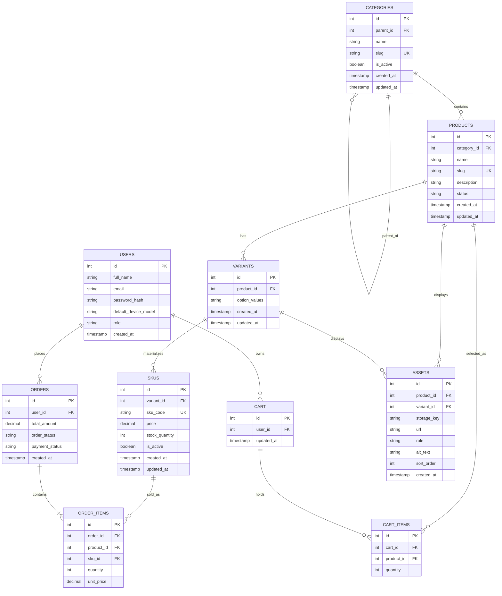

# Sprint 2: Catalog Data Foundation

## 1. Sprint Goal and Scope Boundary

### Sprint Goal

Sprint 2 extends the architecture defined in Sprint 1 into a reliable catalog data foundation for the **Custom Laptop Skins & Device Decals E-Commerce Platform**.

The goal is to create the database structure and administrative foundation required to manage:

- Categories and category hierarchy
- Products
- Product variants
- Sellable SKUs
- Prices and stock quantities
- Basic product administration
- Database constraints and validation
- Seed/demo data
- Automated model, validation, and authorization tests

This catalog foundation will be consumed by Sprint 3 and later storefront, cart, and checkout functionality.

### In Scope

- Category tree management with unique identifiers and slugs
- Product creation and editing
- Product status management
- Product-to-category assignment
- Product variants and valid variant combinations
- Unique SKU codes
- SKU price and stock management
- Authenticated administrator operations
- Database migrations/schema definitions
- Seed data
- Data-integrity validation
- Automated tests

### Out of Scope

The following features are reserved for Sprint 3 or later:

- Dynamic product specifications
- Public catalog search
- Asset/image upload management
- Publication workflows
- Payment gateway integration
- Order placement
- Shipping integration
- Complete shopper checkout flow

These features may be prepared for future integration but are not considered Sprint 2 functionality.

---

## 2. Link to Sprint 1 Decisions

Sprint 2 reuses the business scope and architecture established in Sprint 1.

### Project Domain

The project is an e-commerce platform for **custom laptop skins and device decals**. Its target users include laptop owners, students, professionals, gamers, and technology enthusiasts who want personalized and protective laptop skins.

### Sprint 1 Catalog Concept

Sprint 1 defined the initial catalog around:

- Products
- Categories
- Laptop/device models
- Finishes
- Cart
- Orders
- Order items
- Users

Sprint 2 expands the product catalog model by introducing:

- Category hierarchy
- Product identity
- Product variants
- SKUs
- Product/variant assets
- Product specifications foundation

### Technology Stack Reused from Sprint 1

| Layer | Selected Technology | Purpose |
|---|---|---|
| Frontend | HTML5, CSS3, JavaScript, Bootstrap | Responsive user interface |
| Backend | Node.js + Express.js | REST API and administration operations |
| Database | MongoDB | Catalog and application data storage |
| Authentication | JWT | Stateless user/admin authentication |
| Payment | Stripe Test Mode | Planned for checkout in a later sprint |

### Sprint 1 to Sprint 2 Relationship

Sprint 2 does not replace the Sprint 1 architecture. It refines the catalog portion of the original model so that products can support variants, SKUs, prices, and inventory correctly.

The existing Sprint 1 entities **Users, Cart, Cart_Items, Orders, and Order_Items** remain part of the overall system and will consume the catalog/SKU identities in later sprints.

---

## 3. Updated ERD and Data Dictionary

### Updated ER Diagram



### Entity Definitions

| Entity | Purpose |
|---|---|
| Users | Stores customer and administrator accounts. |
| Categories | Stores product categories and parent-child category relationships. |
| Products | Stores the main identity and descriptive information of a laptop skin product. |
| Variants | Represents product options such as device model, finish, or other valid combinations. |
| SKUs | Represents individually sellable combinations with unique codes, prices, and stock. |
| Assets | Stores references to product or variant images/assets for future catalog use. |
| Cart | Stores a user's current shopping cart. |
| Cart_Items | Stores products selected in a cart. |
| Orders | Stores completed order information. |
| Order_Items | Stores individual products/SKUs included in an order. |

### Data Dictionary

#### Categories

| Field | Type | Constraint | Description |
|---|---|---|---|
| id | INTEGER | PK | Unique category identifier |
| parent_id | INTEGER | FK, nullable | Parent category identifier |
| name | VARCHAR | Required | Category name |
| slug | VARCHAR | UNIQUE, required | URL-friendly category identifier |
| is_active | BOOLEAN | Required | Indicates whether category is active |
| created_at | TIMESTAMP | Required | Creation timestamp |
| updated_at | TIMESTAMP | Required | Last update timestamp |

#### Products

| Field | Type | Constraint | Description |
|---|---|---|---|
| id | INTEGER | PK | Unique product identifier |
| category_id | INTEGER | FK, required | Canonical category |
| name | VARCHAR | Required | Product name |
| slug | VARCHAR | UNIQUE, required | Unique product slug |
| description | TEXT | Optional | Product description |
| status | VARCHAR | Required | Draft, active, or inactive status |
| created_at | TIMESTAMP | Required | Creation timestamp |
| updated_at | TIMESTAMP | Required | Last update timestamp |

#### Variants

| Field | Type | Constraint | Description |
|---|---|---|---|
| id | INTEGER | PK | Unique variant identifier |
| product_id | INTEGER | FK, required | Related product |
| option_values | JSON/TEXT | Required | Variant option values |
| created_at | TIMESTAMP | Required | Creation timestamp |
| updated_at | TIMESTAMP | Required | Last update timestamp |

#### SKUs

| Field | Type | Constraint | Description |
|---|---|---|---|
| id | INTEGER | PK | Unique SKU identifier |
| variant_id | INTEGER | FK, required | Related variant |
| sku_code | VARCHAR | UNIQUE, required | Sellable SKU code |
| price | DECIMAL | Required, non-negative | SKU selling price |
| stock_quantity | INTEGER | Required, non-negative | Available inventory |
| is_active | BOOLEAN | Required | SKU availability |
| created_at | TIMESTAMP | Required | Creation timestamp |
| updated_at | TIMESTAMP | Required | Last update timestamp |

#### Assets

| Field | Type | Constraint | Description |
|---|---|---|---|
| id | INTEGER | PK | Unique asset identifier |
| product_id | INTEGER | FK, optional | Related product |
| variant_id | INTEGER | FK, optional | Related variant |
| storage_key | VARCHAR | Optional | Storage identifier |
| url | VARCHAR | Optional | Asset URL |
| role | VARCHAR | Required | Asset purpose |
| alt_text | VARCHAR | Optional | Accessibility description |
| sort_order | INTEGER | Required | Display order |
| created_at | TIMESTAMP | Required | Creation timestamp |

---

## 4. Administration Route Table

The following routes define the administrative API contract for Sprint 2.

> **Implementation note:** These routes should be updated with the team's actual implementation details if the final backend uses different route names.

| Method | Route | Purpose | Authentication |
|---|---|---|---|
| POST | `/api/v1/admin/products` | Create a draft product | Administrator |
| PATCH | `/api/v1/admin/products/:id` | Update product content/status | Administrator |
| GET | `/api/v1/admin/products` | List administrative products | Administrator |
| POST | `/api/v1/admin/products/:id/skus` | Add a validated SKU | Administrator |
| PATCH | `/api/v1/admin/skus/:id` | Update SKU price, stock, or status | Administrator |
| POST | `/api/v1/admin/categories` | Create a category | Administrator |
| GET | `/api/v1/admin/categories` | Return category tree | Administrator |
| PATCH | `/api/v1/admin/categories/:id` | Update/deactivate category | Administrator |

### Example: Create Product

**Request**

```http
POST /api/v1/admin/products
Authorization: Bearer <ADMIN_TOKEN>
Content-Type: application/json
```

```json
{
  "name": "Minimal Matte Laptop Skin",
  "slug": "minimal-matte-laptop-skin",
  "description": "Clean matte laptop skin for professional and everyday use.",
  "category_id": 2,
  "status": "draft"
}
```

**Expected Response**

```json
{
  "id": 1,
  "name": "Minimal Matte Laptop Skin",
  "slug": "minimal-matte-laptop-skin",
  "category_id": 2,
  "status": "draft"
}
```

### Example: Add SKU

**Request**

```http
POST /api/v1/admin/products/1/skus
Authorization: Bearer <ADMIN_TOKEN>
Content-Type: application/json
```

```json
{
  "variant_id": 1,
  "sku_code": "MMS-MBP14-MATTE",
  "price": 2499.00,
  "stock_quantity": 20,
  "is_active": true
}
```

### Example: Duplicate SKU Error

```json
{
  "error": "SKU code already exists",
  "field": "sku_code"
}
```

Duplicate slugs and SKU codes must return a clear client validation error instead of a server traceback.

---

## 5. Data Integrity and Authorization Decisions

### Category Rules

1. Every category has a unique slug.
2. A category may have an optional parent category.
3. A category cannot become its own ancestor.
4. Deactivating a parent category does not automatically delete its child categories.
5. Inactive categories cannot be selected for new active products without explicit administrative handling.

### Product Rules

1. A product must have a unique slug.
2. A product must have a name and category assignment.
3. A product may exist as a draft without a SKU.
4. A published/active product should have at least one active sellable SKU.
5. Deactivating a product does not physically delete historical order information.

### Variant and SKU Rules

1. A product can have zero or more variants.
2. A sellable product must have one or more valid SKUs.
3. Every SKU has a unique SKU code.
4. Every SKU has its own price and stock quantity.
5. Price must use a decimal or integer minor-unit representation; floating-point money is not used.
6. Stock quantity cannot be negative.
7. Only valid variant combinations are represented.
8. Missing/invalid combinations are not created as fake zero-stock SKUs.
9. Two different SKUs may have the same price.
10. A SKU may have its own price because price belongs to the sellable SKU.

### Cart and Order Rules

1. Future cart items will reference valid catalog identities.
2. Future order items will reference the SKU that was actually sold.
3. Deactivating a product or SKU does not delete historical order records.
4. An inactive or out-of-stock SKU cannot be newly added to a sellable catalog flow.

### Authorization

Administrative write operations require an authenticated administrator.

Unauthorized requests must be rejected before the requested database modification is performed.

Examples:

```text
Unauthenticated user
        ↓
Admin API request
        ↓
Authentication check
        ↓
Rejected: 401 Unauthorized
```

```text
Authenticated normal user
        ↓
Admin API request
        ↓
Role/authorization check
        ↓
Rejected: 403 Forbidden
```

---

## 6. Seed Data and Demonstration Instructions

### Required Seed Data

The Sprint 2 seed dataset should contain:

- At least two category levels
- At least three products
- At least one product with multiple variants
- At least four valid SKUs
- At least one intentionally unavailable variant combination

### Example Category Tree

```text
Laptop Skins
├── Minimalist
│   ├── Matte
│   └── Carbon Fiber
└── Professional
    └── Business
```

### Example Products

| Product | Category | Example Variants |
|---|---|---|
| Minimal Matte Laptop Skin | Minimalist | MacBook Air 13, Dell XPS 13 |
| Carbon Fiber Laptop Skin | Minimalist | HP Pavilion, Lenovo ThinkPad |
| Professional Business Skin | Professional | MacBook Pro 14, Dell XPS 15 |

### Example SKU Data

| SKU Code | Product | Variant | Price | Stock | Active |
|---|---|---|---:|---:|---|
| MMS-MBA13-MATTE | Minimal Matte Laptop Skin | MacBook Air 13 / Matte | 2499.00 | 20 | Yes |
| MMS-DXPS13-MATTE | Minimal Matte Laptop Skin | Dell XPS 13 / Matte | 2599.00 | 15 | Yes |
| CFS-HP15-TEXT | Carbon Fiber Laptop Skin | HP Pavilion / Textured | 2799.00 | 10 | Yes |
| PBS-MBP14-GLOSS | Professional Business Skin | MacBook Pro 14 / Gloss | 2999.00 | 8 | Yes |

### Demonstration Flow

The administration demonstration should show:

1. Administrator authentication.
2. Create a category.
3. Create a product.
4. Create a product variant.
5. Create a SKU.
6. Retrieve the category/product/SKU records through the administration API.
7. Attempt a duplicate SKU and show validation rejection.
8. Attempt invalid/negative stock and show validation rejection.

Tokens and private URLs must be removed from screenshots or documentation before committing the file.

---

## 7. Test Strategy, Command, and Result

### Automated Test Coverage

The automated test suite should cover both successful operations and rejection paths.

| Test Area | Expected Result |
|---|---|
| Product creation | Valid product is created |
| SKU creation | Valid SKU is created |
| Duplicate product slug | Request is rejected |
| Duplicate SKU code | Request is rejected |
| Category hierarchy | Valid parent-child relationship is accepted |
| Category cycle | Circular category relationship is rejected |
| Negative stock | Request is rejected |
| Invalid variant combination | Request is rejected |
| Unauthorized admin request | Request is rejected |
| Authorized admin request | Request is accepted |

### Suggested Test Command

For the Node.js/Express implementation:

```bash
npm test
```

If the project uses a different test runner, replace the command above with the actual command used by the repository.

### Test Result

```text
Test command:
npm test

Result:
[Update with the actual test output before submission]
```

The final repository should record the real test result rather than a manually invented result.

---

## 8. Known Limitations and Sprint 3 Backlog

### Known Sprint 2 Limitations

The following functionality is intentionally not completed in Sprint 2:

- Public product search
- Dynamic specifications
- Full product asset upload
- Public catalog browsing
- Publication workflow
- Payment gateway integration
- Customer checkout
- Shipping integration
- Complete order placement workflow

### Sprint 3 Backlog

Sprint 3 can build on the Sprint 2 catalog foundation by implementing:

1. Dynamic product specifications
2. Product and variant asset management
3. Public catalog read APIs
4. Catalog search and filtering
5. Product publication rules
6. Catalog-to-cart integration
7. Device model and finish filtering
8. Shopper-facing product detail pages
9. Preparation for cart and checkout workflows

Sprint 3 should consume the existing product and SKU identities instead of creating duplicate product or pricing logic.

---
